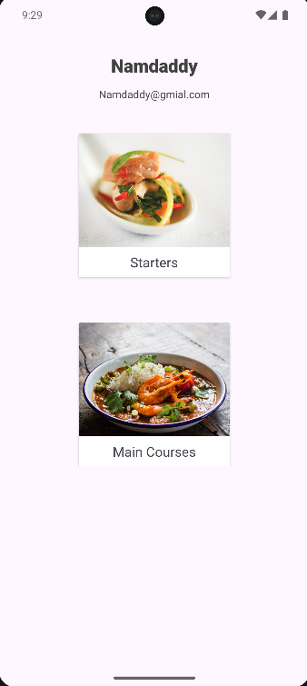
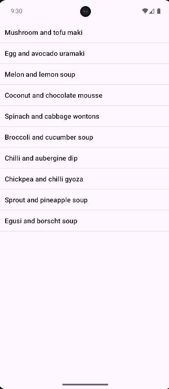
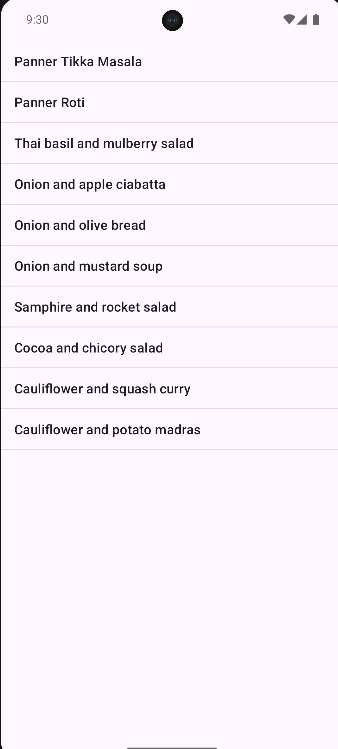

# Namdhari Foods App

Namdhari Foods is a simple Android application that displays a list of starters and main courses. Users can browse dishes, view their details, and contact the restaurant via email.

---

## Features

- Browse starters and main courses.
- View dish title, description, and price.
- Launch default email app to contact the restaurant.
- Modern edge-to-edge UI support.
- Responsive layout with proper system bar padding.

---

## Screenshots

<table>
  <tr>
    <th>Homescreen</th>
    <th>Starters</th>
    <th>MainCourses</th>
  </tr>
  <tr>
    <td></td>
    <td></td>
    <td></td>
  </tr>
</table>
---

## Installation

1. Clone the repository:
   ```bash
   git clone https://github.com/Notshreyasrbhat/NamdhariFoods.git


2. Open the project in Android Studio.
3. Build and run the app on an emulator or physical device.

---

## Project Structure

* `MainActivity.java` – Displays the main menu with starters and main courses cards.
* `StartersActivity.java` – Shows a list of starter dishes.
* `MainCoursesActivity.java` – Shows a list of main course dishes.
* `Dish.java` – Model class representing a dish (title, description, price).
* `activity_main.xml`, `activity_starters.xml`, `activity_main_courses2.xml` – Layout XML files.
* `AndroidManifest.xml` – App permissions and activity declarations.

---
## License

This project is open-source and free to use for educational purposes.

```

---

If you want, I can also **generate a screenshot folder structure with placeholder images** and **update the README table automatically** so it’s ready to push to GitHub.  

Do you want me to do that next?
```
